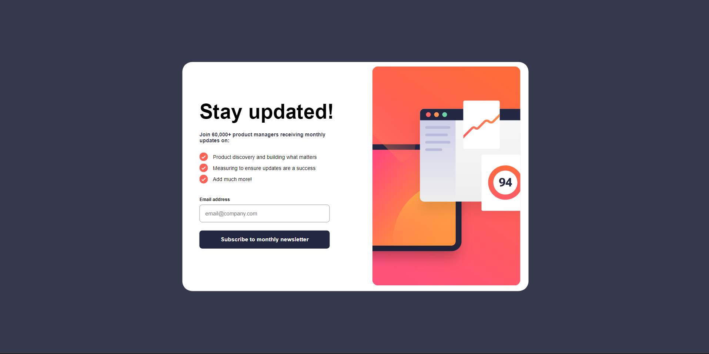

# Frontend Mentor - Newsletter sign-up form with success message solution

This is a solution to the [Newsletter sign-up form with success message challenge on Frontend Mentor](https://www.frontendmentor.io/challenges/newsletter-signup-form-with-success-message-3FC1AZbNrv). Frontend Mentor challenges help you improve your coding skills by building realistic projects. 

### Screenshot

### Links
- [Live site](https://master--0xzaid-newsletter-form.netlify.app/)

### Built with
- [React](https://reactjs.org/) - JS library
- [Styled Components](https://styled-components.com/) - For styles
- Semantic HTML5 markup
- CSS custom properties
- Flexbox
- Mobile-first workflow